# Sample UI Components (RVG, 15-12-20, Version 1)

## Success Criterion [1.4.11 Non-text Contrast](https://www.w3.org/TR/WCAG21/#non-text-contrast) (Level AA)

The visual [presentation](https://www.w3.org/WAI/WCAG21/Understanding/non-text-contrast.html#dfn-presentation) of the following have a [contrast ratio](https://www.w3.org/WAI/WCAG21/Understanding/non-text-contrast.html#dfn-contrast-ratio) of at least 3:1 against adjacent color(s):

- **User Interface Components**; visual information required to identify [user interface components](https://www.w3.org/WAI/WCAG21/Understanding/non-text-contrast.html#dfn-user-interface-component) and [states](https://www.w3.org/WAI/WCAG21/Understanding/non-text-contrast.html#dfn-state), except for inactive components or where the appearance of the component is determined by the user agent and not modified by the author;
- **Graphical Objects**; Parts of graphics required to understand the content, except when a particular presentation of graphics is [essential](https://www.w3.org/WAI/WCAG21/Understanding/non-text-contrast.html#dfn-essential) to the information being conveyed.

## Sample 1

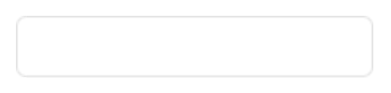

- Type: **Search field**
- Expected outcome (WCAG 1.4.11): **FAIL**
- Source: [https://www.antigifcentrum.be/evenementen](https://www.antigifcentrum.be/evenementen)
- Selector Path: `#edit-k`

## Sample 2

- Type: **Submit button**
- Expected outcome (WCAG 1.4.11): **FAIL**
- Source: [https://www.antigifcentrum.be/evenementen](https://www.antigifcentrum.be/evenementen)
- Selector Path: `#edit-submit-search`

## Sample 3

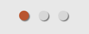

- Type: **Pagination widget**
- Expected outcome (WCAG 1.4.11): **FAIL**
- Source: [https://www.antigifcentrum.be/evenementen](https://www.antigifcentrum.be/evenementen)
- Selector Path: `#highlights > div.view.view-nieuws.view-id-nieuws.view-display-id-block.view-dom-id-a1950f9a5d19c2090c16fa0298ca26b2 > div.view-content > div > div > div.bx-controls.bx-has-pager.bx-has-controls-direction > div.bx-pager.bx-default-pager`

## Sample 4

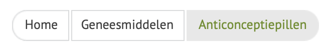

- Type: **Breadcrumb trail** (looks like Pill toggle)
- Expected outcome (WCAG 1.4.11): **PASS**
- Source: [https://www.antigifcentrum.be/geneesmiddelen/anticonceptiepil](https://www.antigifcentrum.be/geneesmiddelen/anticonceptiepil)
- Selector Path: `#content > div.clearfix > div.region-content > div.clearfix > div`

## Sample 5

- Type: **Checkbox group** (custom styled)
- Expected outcome (WCAG 1.4.11): **FAIL**
- Source: [https://www.apotheek.be/nl/Pages/default.aspx](https://www.apotheek.be/nl/Pages/default.aspx)
- Selector Path: `#CybotCookiebotDialogBodyLevelButtonsSelectPane`

## Sample 6

- Type: **Button** (disguised as a link)
- Expected outcome (WCAG 1.4.11): **PASS**
- Source: [https://www.apotheek.be/nl/Pages/default.aspx](https://www.apotheek.be/nl/Pages/default.aspx)
- Selector Path: `#CybotCookiebotDialogBodyLevelButtonLevelOptinAllowallSelection`

## Sample 7

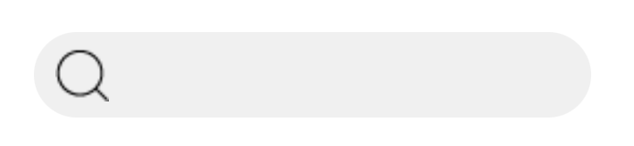

- Type: **Search field**
- Expected outcome (WCAG 1.4.11): **FAIL** 
- Source: [https://www.apotheek.be/nl/Pages/default.aspx](https://www.apotheek.be/nl/Pages/default.aspx)
- Selector Path: `#ctl00_ctl09_ctl02_ctl00_ctl47_ctl01_search`

## Sample 8

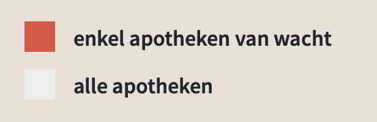

- Type: **Checkbox collection**
- Expected outcome (WCAG 1.4.11): **FAIL** (unchecked checkbox not identifiable)
- Source: [https://www.apotheek.be/nl/Pages/default.aspx](https://www.apotheek.be/nl/Pages/default.aspx)
- Selector Path: `#find-box > div > div'
	`
## Sample 9

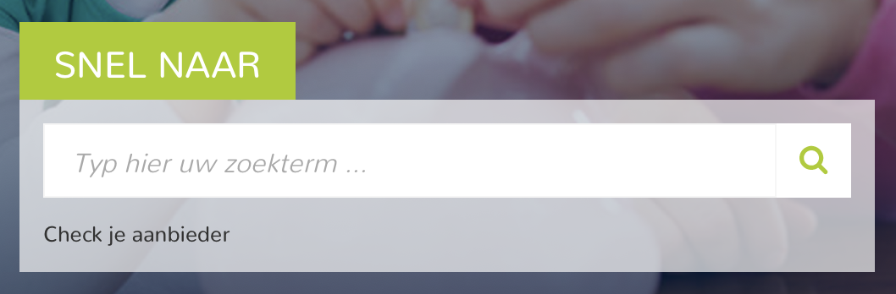

- Type: **Search field**
- Expected outcome (WCAG 1.4.11): **FAIL** (heading, placeholder)
- Source: [https://www.fsma.be/nl](https://www.fsma.be/nl)
- Selector Path: `#views-exposed-form-search-page-consumers > div > div`

## Sample 10

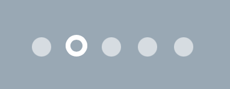

- Type: **Pagination widget**
- Expected outcome (WCAG 1.4.11): **FAIL**
- Source: [https://www.fsma.be/nl](https://www.fsma.be/nl)
- Selector Path: `#block-views-news_articles-block > div > ol`

## Sample 11

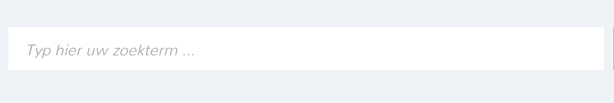

- Type: **Search field**
- Expected outcome (WCAG 1.4.11): **FAIL**
 - Source: [https://www.fsma.be/nl](https://www.fsma.be/nl)
- Selector Path: `#edit-search-api-views-fulltext-wrapper`

## Sample 12

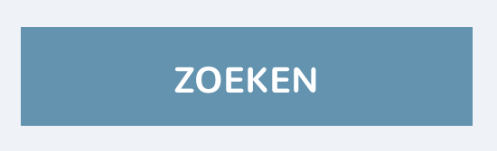

- Type: **Search button**
- Expected outcome (WCAG 1.4.11): **PASS**
 - Source: [https://www.fsma.be/nl](https://www.fsma.be/nl)
- Selector Path: `#edit-submit-search-page`

## Sample 13

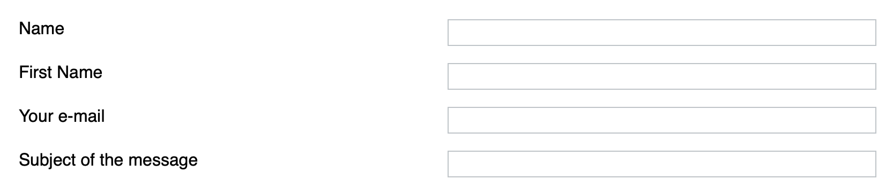

- Type: **Multiple text inputs** (traditional text inputs, custom styled)
- Expected outcome (WCAG 1.4.11): **FAIL** (very close call)
- Source: [https://www.uniquelyphenomenal.be/en/contact](https://www.uniquelyphenomenal.be/en/contact)
- Selector Path: `#contact > div > div.content > form`

## Sample 14

- Type: **Submit button** (traditional text inputs, custom styled)
- Expected outcome (WCAG 1.4.11): **FAIL** (very close call)
- Source: [https://www.uniquelyphenomenal.be/en/contact](https://www.uniquelyphenomenal.be/en/contact)
- Selector Path: `#contact > div > div.content > form > div.formelement.align-right > button`

## Sample 15

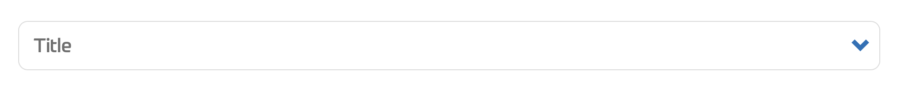

- Type: **Combobox**
 - Expected outcome (WCAG 1.4.11): **FAIL** (very close call)
- Source: [https://belnet.be/en/form/contact](https://belnet.be/en/form/contact)
- Selector Path: `#edit-name-title-select`

## Sample 16

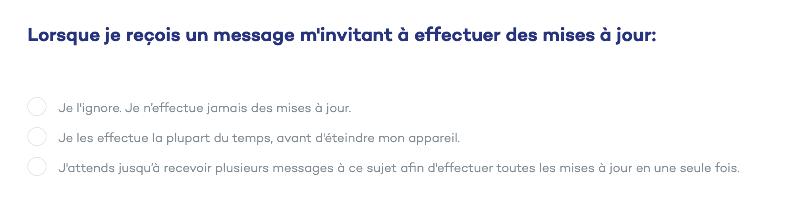

- Type: **Radio Group**
 - Expected outcome (WCAG 1.4.11): **FAIL**
- Source: [https://campagne.safeonweb.be/fr/testez-votre-sante-digitale](https://campagne.safeonweb.be/fr/testez-votre-sante-digitale)
- Selector Path: `#field_answers\.updates\.0_s5iz2iox8m > div`

